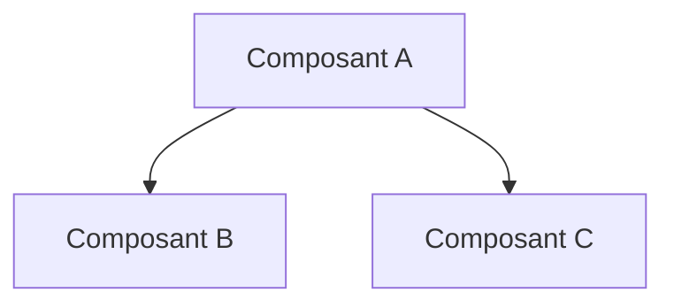

# RULES-FORMAT-SORTIE

## Principe

Tous les livrables produits par les agents doivent suivre des formats standardisés pour garantir la cohérence, la lisibilité et l'exploitabilité des documents.

---

## Formats de base

### Markdown

Tous les documents utilisent Markdown avec les conventions suivantes :

```markdown
# Titre principal (un seul par document)

## Section majeure

### Sous-section

#### Détail (éviter d'aller plus profond)
```

### Conventions typographiques

| Élément | Format | Exemple |
|---------|--------|---------|
| Titre de document | `# Titre` | `# Plan de Projet` |
| Section | `## Section` | `## Objectifs` |
| Sous-section | `### Sous-section` | `### Phase 1` |
| Liste à puces | `- Item` | `- Première tâche` |
| Liste numérotée | `1. Item` | `1. Étape initiale` |
| Checklist | `- [ ] Item` | `- [ ] À faire` |
| Code inline | `` `code` `` | `variable` |
| Bloc de code | ``` ```lang ``` | Voir exemples |
| Emphase légère | `*italique*` | *important* |
| Emphase forte | `**gras**` | **critique** |
| Lien | `[texte](url)` | [Documentation](url) |

---

## Formats structurés

### Tableaux

Utiliser les tableaux pour les données comparatives :

```markdown
| Colonne 1 | Colonne 2 | Colonne 3 |
|-----------|-----------|-----------|
| Valeur 1  | Valeur 2  | Valeur 3  |
```

Conventions :
- En-têtes explicites
- Alignement cohérent
- Pas plus de 6 colonnes (sinon, découper)

### Matrices de risques

Format standard :

```markdown
| Risque | Impact | Probabilité | Score | Mitigation |
|--------|--------|-------------|-------|------------|
| [Description] | Haut/Moyen/Bas | Haut/Moyen/Bas | H/M/B | [Action] |
```

Calcul du score :
- Impact Haut + Proba Haute = **H** (critique)
- Impact Haut + Proba Moyenne = **H**
- Impact Moyen + Proba Haute = **M**
- Autres combinaisons = **M** ou **B**

### ADR (Architecture Decision Record)

Format standard :

```markdown
## ADR-XXX : [Titre de la décision]

### Statut
[Proposé / Accepté / Déprécié / Remplacé par ADR-YYY]

### Contexte
[Pourquoi cette décision est nécessaire]

### Décision
[Ce qui a été décidé]

### Conséquences
- Avantages : [...]
- Inconvénients : [...]
- Risques : [...]

### Alternatives considérées
| Alternative | Raison du rejet |
|-------------|-----------------|
```

---

## Formats de livrables spécifiques

### Proposition d'agent

```markdown
## Proposition : [Titre]

### Résumé
[2-3 phrases]

### Détail
[Description complète]

### Hypothèses
- [Hypothèse 1]
- [Hypothèse 2]

### Risques identifiés
| Risque | Impact | Mitigation |
|--------|--------|------------|

### Alternatives considérées
| Alternative | Raison du rejet |
|-------------|-----------------|

### Questions ouvertes
- [Question 1]
```

### Critique d'agent

```markdown
## Critique de : [Référence à la proposition]

### Score de confiance : X/5

### Points forts
- [Point 1]
- [Point 2]

### Points à améliorer
| Aspect | Problème | Suggestion |
|--------|----------|------------|

### Contre-propositions
- [Alternative 1]

### Verdict
[Accepter / Réviser / Revoir]
```

### Synthèse de débat

```markdown
## Synthèse : [Sujet du débat]

### Participants
[Liste des agents]

### Question initiale
[Question posée]

### Positions exprimées
| Agent | Position | Arguments clés |
|-------|----------|----------------|

### Points de convergence
- [Point 1]

### Points de divergence
- [Point 1]

### Décision finale
[Décision prise]

### Justification
[Pourquoi cette décision]

### Actions suivantes
| Action | Responsable | Échéance |
|--------|-------------|----------|
```

---

## Diagrammes

### Diagrammes ASCII

Privilégier les diagrammes ASCII pour leur portabilité :

```
┌─────────────┐     ┌─────────────┐
│  Composant  │────▶│  Composant  │
│      A      │     │      B      │
└─────────────┘     └─────────────┘
        │
        ▼
┌─────────────┐
│  Composant  │
│      C      │
└─────────────┘
```

Caractères recommandés :
- Boîtes : `┌ ┐ └ ┘ │ ─`
- Flèches : `▶ ▼ ◀ ▲ → ← ↑ ↓`
- Connexions : `├ ┤ ┬ ┴ ┼`

### Mermaid (si supporté)



---

## Conventions de nommage

### Fichiers

| Type | Format | Exemple |
|------|--------|---------|
| Workflow | `XX-WF-NOM.md` | `01-WF-BRAINSTORM-IDEES.md` |
| Règle | `XX-RULES-NOM.md` | `01-RULES-DEBAT-GENERAL.md` |
| Agent | `XX-AGENT-NOM.md` | `01-AGENT-ARCHITECTE.md` |
| Template | `TPL-NOM.md` | `TPL-DEVOPS.md` |

Conventions :
- Préfixe numérique pour l'ordre
- Majuscules avec tirets
- Pas d'espaces, pas d'accents

### Identifiants

| Type | Format | Exemple |
|------|--------|---------|
| ADR | `ADR-XXX` | `ADR-001` |
| Risque | `RSK-XXX` | `RSK-012` |
| Action | `ACT-XXX` | `ACT-005` |
| Décision | `DEC-XXX` | `DEC-003` |

---

## Langue et style

### Langue
- **Français** pour tout le contenu
- Termes techniques en anglais si pas d'équivalent établi (ex: "heartbeat", "dry-run")

### Style
- Phrases courtes et directes
- Voix active préférée
- Éviter le jargon inutile
- Définir les acronymes à la première utilisation

### Formulations à privilégier

| Éviter | Préférer |
|--------|----------|
| "Il faudrait peut-être..." | "Recommandation : ..." |
| "On pourrait envisager..." | "Option proposée : ..." |
| "C'est pas mal" | "Points forts : ..." |
| "Y'a un souci avec..." | "Risque identifié : ..." |

---

## Validation du format

Avant de soumettre un livrable, vérifier :

- [ ] Un seul `#` titre par document
- [ ] Hiérarchie de sections cohérente
- [ ] Tableaux correctement formatés
- [ ] Pas de TODO ou placeholder restant
- [ ] Liens fonctionnels
- [ ] Code dans des blocs avec langage spécifié
- [ ] Pas de lignes > 120 caractères (sauf tableaux)
